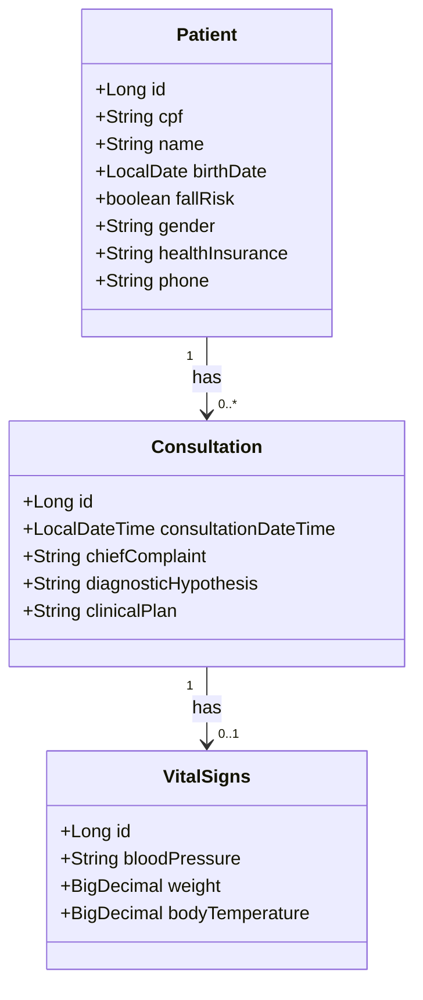

# Diagrama UML Inicial

## Termos clínicos

- `chiefComplaint`: queixa principal.
- `diagnosticHypothesis`: hipótese diagnóstica.
- `clinicalPlan`: conduta clínica.
- `bloodPressure`: pressão arterial.
- `bodyTemperature`: temperatura corporal.
- `fallRisk`: risco de queda.

## Relações

- Um `Patient` pode possuir nenhuma ou várias `Consultation`.
- Cada `Consultation` pertence a um `Patient`.
- Uma `Consultation` pode possuir no máximo um registro de `VitalSigns`.
- Cada `VitalSigns` pertence a uma única `Consultation`.